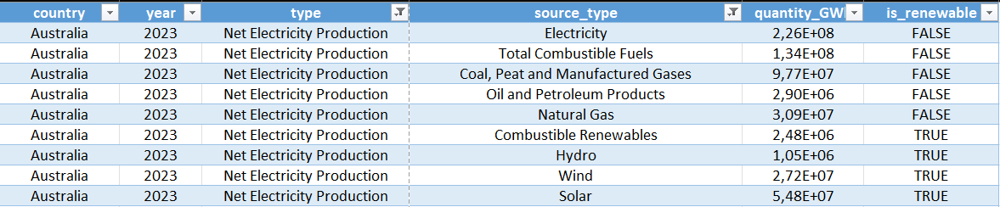
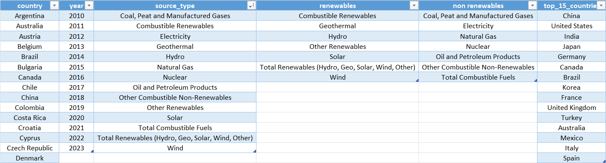
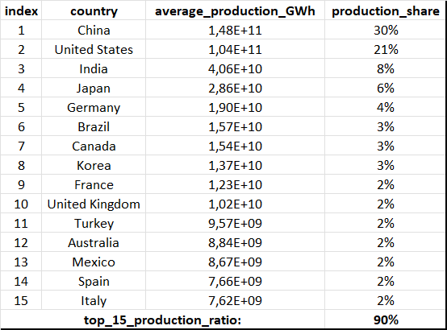
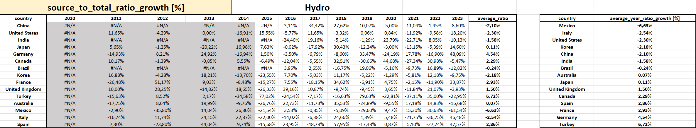
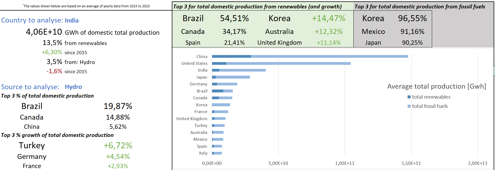

# Global Electricity Production Report – Interactive Excel Dashboard

This project focuses on the analysis and visualization of global electricity production data, with a specific emphasis on renewable energy production trends. An interactive dashboard was built to allow data exploration by country and by energy source.

The dataset can be freely downloaded at the following link:
[https://www.kaggle.com/datasets/sazidthe1/global-electricity-production](https://www.kaggle.com/datasets/sazidthe1/global-electricity-production)

## Project objectives

* Identify the main global producers (top 15 → 90% of global production), along with their respective production shares.
* Create an interactive dashboard to:
* Identify, for each country, the share of electricity production from renewable sources relative to total electricity production.
* Show, for each country, production shares and growth trends by specific energy sources.

## Index

- [Global Electricity Production Report – Interactive Excel Dashboard](#global-electricity-production-report--interactive-excel-dashboard)
  - [Project objectives](#project-objectives)
  - [Index](#index)
  - [Project summary](#project-summary)
    - [Data cleaning](#data-cleaning)
    - [List creation and sorting](#list-creation-and-sorting)
    - [Top 15 study](#top-15-study)
    - [Analysis](#analysis)
    - [Interactive dashboard](#interactive-dashboard)

## Project summary

### Data cleaning



1. Loading the `.csv` file using Power Query.
2. Filtering out all unnecessary entries.
3. Converting values into the correct formats.
4. Adding helper columns to facilitate subsequent conditional summation operations.

<details>
  <summary>Technical details:</summary>

The `SORT(UNIQUE())` function was used to collect and organize entries within the dataset.

</details>

---

### List creation and sorting



1. Extraction, aggregation, and sorting of key data such as country, year, and energy source type.
2. Discrimination between renewable and non-renewable sources.

<details>
  <summary>Technical details:</summary>

1. The `ISNUMBER(MATCH())` function was used to generate the helper column *is_renewable*. This helper column allows discrimination between renewable and non-renewable sources.
2. Since the analysis focuses on aggregating energy production values year by year, the year was extracted from the *date* column using the `YEAR()` function.

</details>

---

### Top 15 study



To simplify the analysis, only the top 15 countries by electricity production were considered, as they alone contribute 90% of total global electricity production.

<details>
  <summary>Technical details:</summary>

To verify this, a table with total yearly production for each country was calculated using the following function:

```
IFERROR(
SUMIFS(
global_electricity_production!$E$2:$E$121070;
global_electricity_production!$A$2:$A$121070;"="&study!$B3;
global_electricity_production!$B$2:$B$121070;"="&study!C$2);
NA())
```

using country and production year as conditions.

From this point onward, values from 2010 to 2014 were excluded, as they were not available for some countries in the list.

Average production values over the selected time window were then calculated, and the top 15 values were extracted using the function:

```
=INDEX(SORT(Q3:Q50;1;-1;FALSE);SEQUENCE(15);1)
```

A similar function was used to retrieve and sort country names.

</details>

---

### Analysis



This worksheet contains the calculations required to achieve the remaining project objectives.

Several tables were created showing electricity production quantities by year and country, both from renewable sources and in total. Average values and average production growth rates since 2015 were then derived.

<details>
  <summary>Technical details:</summary>

As in the previous section, conditional summations were used:

```
=IF(

SUMIFS(

global_electricity_production!$E$2:$E$121070;

global_electricity_production!$A$2:$A$121070;"="&$C4;
global_electricity_production!$B$2:$B$121070;"="&I$3;
global_electricity_production!$F$2:$F$121070;"="&is_renewable

)<>0;

SUMIFS(

global_electricity_production!$E$2:$E$121070;

global_electricity_production!$A$2:$A$121070;"="&$C4;
global_electricity_production!$B$2:$B$121070;"="&I$3;
global_electricity_production!$F$2:$F$121070;"="&is_renewable
);

NA())
```

Special attention was paid to missing data, which could have affected the calculation of average values. By returning `NA()` when the sum is zero, the corresponding cell is excluded from average calculations.

The `SORT()` and `SORTBY()` functions were essential for reordering results and enabling the visualization of charts and rankings on the dashboard.

</details>

---

### Interactive dashboard



The data obtained from the previous analysis were ultimately referenced in a summary dashboard sheet.

The page is divided into two sections:

* Interactive section on the left:
  Two dropdown menus are available, *country* and *source*. Selecting a specific combination recalculates the tables to provide general data for the selected country and rankings in terms of production shares and growth rates for the selected energy source.

* Static section on the right:
  At the top, countries with the highest renewable energy production or highest growth rates are displayed.
  At the bottom, a bar chart shows average total production for each country, which is useful to visually highlight the share of renewable energy generated relative to total production.