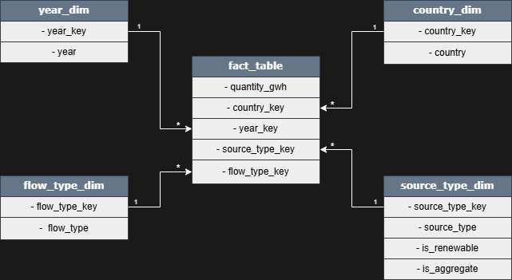

# Data Model Overview

Questo documento descrive il modello dati a stella realizzato con Power Query e Power Pivot.

## Architettura generale

Il modello adotta una struttura a stella composta da:
- una tabella dei fatti centrale
- quattro tabelle dimensionali
- relazioni one-to-many dalle dimensioni alla tabella dei fatti

  

  <em>Schema a stella del modello dati - tabella dei fatti e dimensioni</em>

Questa impostazione rende il progetto:
- robusto dal punto di vista analitico
- facilmente estendibile

## Tabella dei fatti

La tabella dei fatti contiene i valori quantitativi del modello e le foreign key verso le dimensioni.

| Campo             | Tipo    | Descrizione                              |
|:-|:-|:-|
| `quantity_gwh`    | Number  | Quantità di energia in GWh.              |
| `country_key`     | Integer | Riferimento a `country_dim`.             |
| `year_key`        | Integer | Riferimento a `year_dim`.                |
| `source_type_key` | Integer | Riferimento a `source_type_dim`.         |
| `flow_type_key`   | Integer | Riferimento a `flow_type_dim`.           |

La logica analitica è demandata alle dimensioni e alle misure DAX.

## Tabelle dimensionali

### country_dim
Contesto geografico per confronti e ranking tra paesi.

### year_dim
Contesto temporale utilizzato per analisi storiche.

### source_type_dim
Classifica le fonti energetiche e abilita le analisi di transizione energetica.

### flow_type_dim
Definisce la natura del flusso energetico e consente di separare KPI e indicatori di contesto.

*Torna al [README](/readme.it.md)*