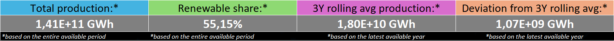
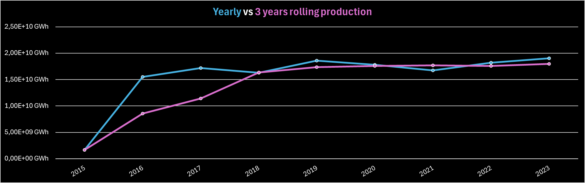
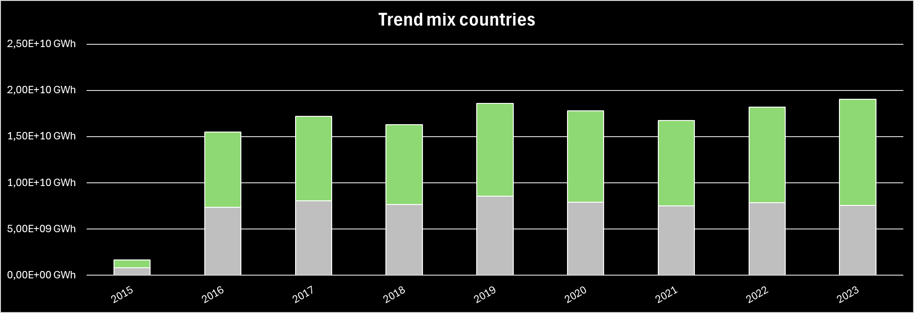
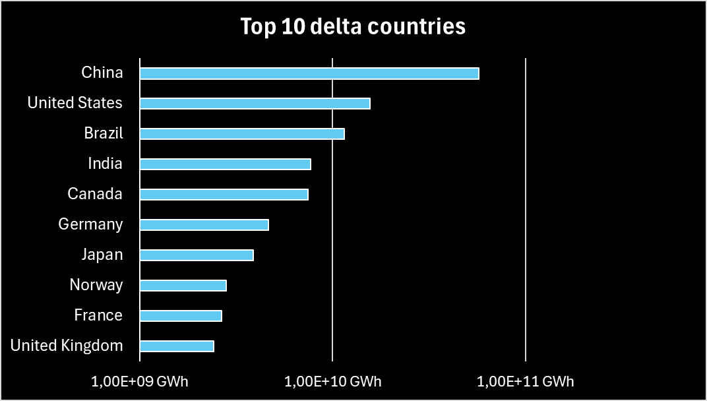

# Dashboard Overview

This dashboard summarizes the key indicators related to **global electricity production**, based on the data model built in Power Query and Power Pivot.

## Dashboard objective

The main objective is to **analyze the evolution of global electricity production**, with particular attention to:

- overall size of the energy system  
- energy transition (renewables vs non-renewables)  
- long-term trend stability  
- the real contribution of individual countries to global growth  

The dashboard adopts a **production-first** approach and uses only energy flows and sources that are **meaningful and comparable**.

## Dashboard structure

The dashboard is composed of:

- 4 KPI cards
- 3 main charts
- 2 slicers

This structure ensures a good balance between **information, readability, and immediacy**.

  

  <em>Dashboard overview</em>

## Slicers

The dashboard uses **two slicers**, to keep simplicity and control. The `Country` slicer applies to the following elements:

- 4 KPIs
- Total production trend
- Energy mix trend

The `Renewables_only` slicer affects only the Top 10 chart, recalculating the ranking based on the selected source type.

No slicers are used for:
- year  
- flow type  
- individual energy sources  

## KPI cards

The 4 KPI cards are built in Excel as **formatted cells**, powered by **DAX measures** and pivot tables.

  

  <em>Main KPIs</em>

- **Total Produced (GWh)**  
  Measures overall production.

- **Renewable Share (%)**  
  Core energy transition KPI, calculated on total production.

- **Rolling 3Y Total Production (GWh)**  
  Represents the structural production trend by reducing annual volatility.

- **Deviation vs Rolling 3Y (GWh)**  
  Highlights energy shocks or anomalies relative to the long-term trend.

These KPIs change based on the selected country through the geographic slicer.

## Country production time trend

This chart compares historical production with the structural trend cleaned from annual noise.

  

  <em>Electricity production trend with a 3-year rolling average</em>

The 3-year rolling average replaces year-by-year analysis, making the trend more stable and readable.

## Country energy mix evolution

This chart shows how the composition of electricity production changes over time.

  

  <em>Energy mix evolution: renewables vs non-renewables</em>

No single-source breakdown is shown to avoid excessive granularity and keep the focus on the main message.

## Top 10 countries by energy contribution and energy source type

The bar chart highlights the main countries contributing to global electricity production growth across the entire available time span. The ranking is recalculated based on the flag selected via the `is_renewable` slicer, to limit the analysis to renewable or non-renewable sources.

  

  <em>Largest contributions to electricity production across the full available period</em>

## Design principles

The dashboard follows a few key principles:

- Single source of truth:  
  All KPIs derive from `total_produced_gwh`.

- Minimalism:  
  Few visuals, each with a clear message.

- Stability:  
  Rolling averages are preferred to YoY comparisons.

- Comparability:  
  KPIs are consistent across countries and over time.

## Key findings

- Total electricity production increases sharply from 2016–2017, then stabilizes through 2023.
- In most analyzed countries, no clear trend emerges in the growth of the renewable share (percentage).
- The ranking of the main producers remains stable over time, with China, the USA, and India leading both renewables and non-renewables.
- China is consistently the top global producer; Brazil stands out for high cumulative renewable production over the period.

### Analysis limitations

- Sources labeled as *electricity* were classified as non-renewable; since this is an aggregated category, renewable production may be underestimated.
- The lack of a clear increase in the renewable share suggests that production growth has not been accompanied by an evident structural transition.
- The total production increase observed from 2016–2017 is likely influenced by more complete data availability in recent years.
- Production levels prior to 2016 are therefore less reliable due to incomplete coverage.
- The Top 10 producer list is highly persistent; China leads all metrics, while Brazil surpasses India in cumulative renewable production.

*Back to the [README](/readme.md)*
