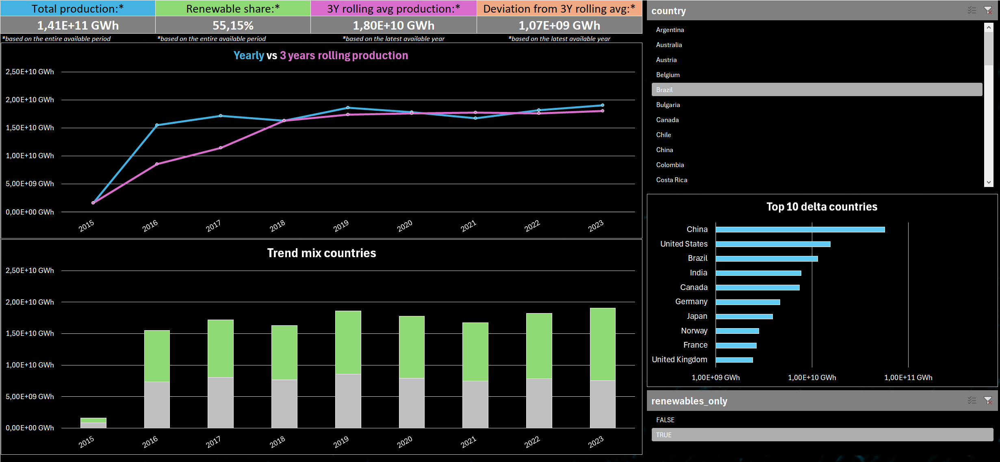

# Global electricity production – Data analysis with Excel Power Pivot

Analysis of the evolution of global electricity production, with a focus on **energy transition** and the **stability of long-term trends**.

The project is designed as a **portfolio project** and emphasizes:
- data modeling
- KPI analytical consistency
- temporal comparability
- decision-oriented reporting

## Project objective

The goal is to provide a **concise, stable, and time-comparable** view of the global electricity production system, answering key questions such as:

- How does global electricity production evolve over the long term?
- What is the relative contribution of renewable and non-renewable sources?
- Are the observed trends structural, or driven by annual volatility?
- Are there significant cross-country differences in terms of energy mix?
- Is renewable production growth proportional to total volumes, or concentrated in specific areas?

The adopted approach is **KPI-driven** and oriented to **decision support**, prioritizing stability and interpretability over transactional detail.

## Dataset

The source dataset contains information about:

- country
- date (used exclusively to extract the year)
- energy flow type
- energy source
- produced energy quantity (GWh)

The dataset is not normalized and requires a complete ETL (extract, transform, load) process before it can be used in an analytical model.

## Data cleaning and transformation

The transformation process was implemented entirely in **Power Query** and includes:

1. importing the CSV file
2. explicit data type conversion
3. category normalization:
   - energy sources
   - energy flows
4. extracting the year from the date
5. creating dimension tables
6. building the fact table with **surrogate keys**
7. excluding non-analytical fields from core KPIs

The result is a **repeatable and stable data model**, optimized for long-term analysis.

## Data model

The model uses a **star schema**, composed of:

- a **fact table** containing energy quantities
- dimension tables for:
  - geographic context
  - temporal context
  - energy source
  - flow type

  

  <em>Star schema of the data model - fact table and dimensions</em>

Relationships are:
- one-to-many
- single-direction

## KPIs and analytical logic

The main KPIs are designed to ensure **semantic consistency** and comparability:

- total electricity production
- renewable energy share
- time trends via a **3-year rolling average**
- cross-country comparison on a consistent basis

Metrics prioritize structural readings over isolated year-to-year fluctuations.

## Dashboard

From the data model, an **analytical dashboard** was built in Excel with **Power Pivot**.

The dashboard provides:
- an overview of key energy indicators
- stable time analyses
- comparison across countries and sources

  

  <em>Dashboard overview</em>

## Methodological choices

- Core KPIs are based on **total electricity production**, defined as the sum of:
  - net production
  - exported energy
- Flows other than `net_produced` and `exported` are excluded from the analytical core because they represent usage, losses, or system exchanges
- 3-year rolling averages are used to reduce volatility and make structural trends readable

The project prioritizes **analytical stability and interpretability** over maximizing detail.

## Key findings

- Growth in global electricity production is concentrated in countries with the largest absolute volumes, with rankings remaining broadly stable over time.
- In most of the selected countries, no clear structural trend emerges in the increase of the renewable share (percentage).
- A sharp increase in total production is observed starting in 2016–2017, followed by stabilization through 2023.
- Pre-2016 dynamics are less reliable due to incomplete data coverage.
- The presence of aggregated energy categories may lead to an underestimation of renewable production.
- 3-year rolling averages improve readability of medium-term dynamics by reducing annual volatility.

## Preliminary traditional Excel version

The repository includes an initial version developed in **traditional Excel**, based on formulas and manual calculations.

This version is intentionally kept **without further optimization** in order to:

- document the project evolution
- show calculation logic in traditional Excel
- highlight scalability limits of a non-modeled approach

The final solution is based on **Power Query and Power Pivot**.

## Tools Used

- **Data cleaning:** Excel Power Query
- **Data modeling and visualization:** Excel Power Pivot + DAX measures
- **IDE:** Visual Studio Code
- **Version control and documentation:** Git / GitHub

## Skills demonstrated

- star schema data modeling
- ETL design in Power Query
- DAX measure development
- energy analytics
- time-stable KPI design
- structured technical documentation

## Technical documentation

- [Data loading and transformation](03_etl/etl.md)
- [Data model overview](04_data_model/model_overview.md)
- [DAX measures and KPI logic](05_dax/dax.md)
- [Dashboard](06_dashboard/dashboard_overview.md)
- [Preliminary version](/00_legacy_excel_traditional)
- *[Original dataset](https://www.kaggle.com/datasets/sazidthe1/global-electricity-production)*
